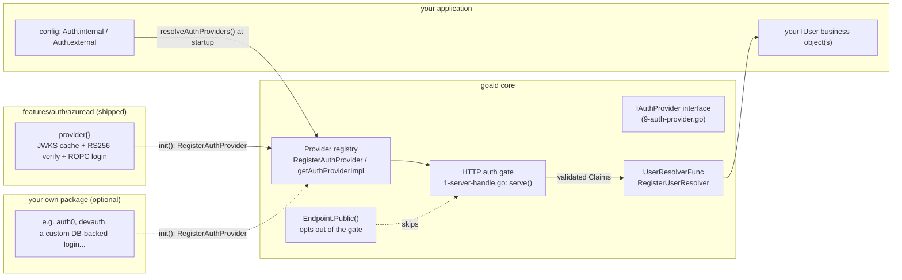
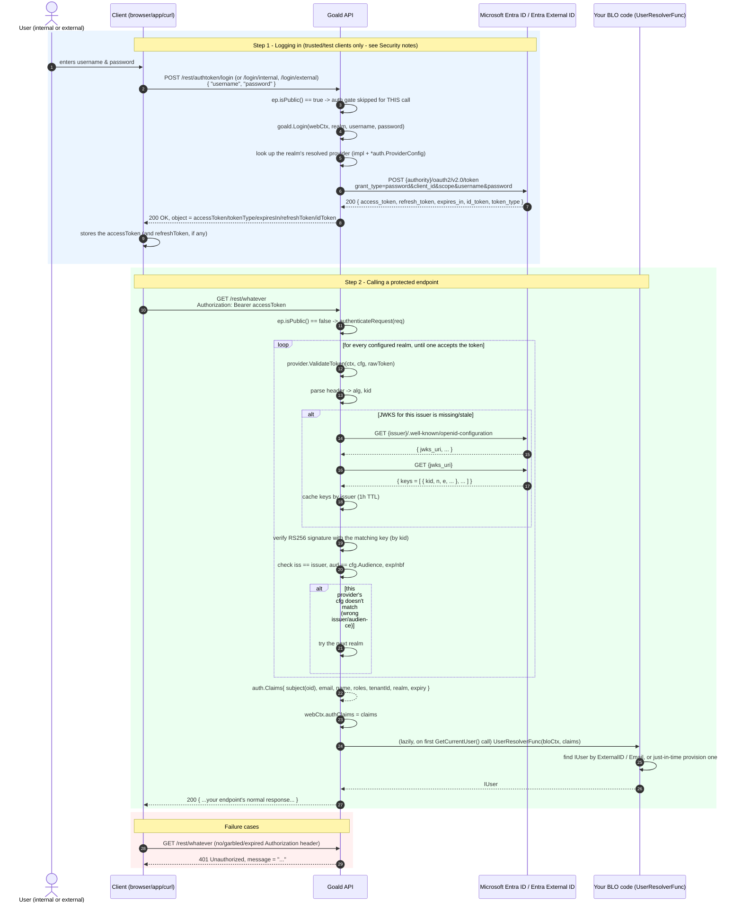

# Authentication in Goald: Entra ID (internal users) + Entra External ID (external users)

Goald authenticates API callers through a small, pluggable interface (`goald.IAuthProvider`). Out
of the box it ships an implementation backed by **Microsoft Entra ID**, used twice, for 2 separate
**realms**:

- `internal` — your internal users (staff), backed by a normal Entra ID (workforce) tenant.
- `external` — your external users (customers, partners...), backed by a Microsoft **Entra External ID** (CIAM) tenant.

Realm names are free-form: they're just the keys of the `auth` config section (`internal` and
`external` are the names used by the shipped login endpoints and examples). Use whatever fits your
business.

Both realms can be active at once, each with its own tenant/app registration, and each realm can
even use a *different* provider implementation if you ever need to (Auth0, a homegrown DB-backed
login, a fake provider for tests, ...). See [Extending / plugging in another provider](#extending--plugging-in-another-provider).

## Contents

- [Architecture](#architecture)
- [How it works, in detail](#how-it-works-in-detail)
- [Configuring Goald](#configuring-goald)
- [Setting things up in Azure](#setting-things-up-in-azure)
  - [Option A: Terraform](#option-a-terraform)
  - [Option B: Azure Portal, step by step](#option-b-azure-portal-step-by-step)
- [Trying it out with curl](#trying-it-out-with-curl)
- [The `User` business object](#the-user-business-object)
- [Extending / plugging in another provider](#extending--plugging-in-another-provider)
- [Security notes](#security-notes)

## Architecture



Key pieces:

| Piece | Where | Role |
|---|---|---|
| `auth.Realm`, `auth.ProviderConfig`, `auth.Claims`, `auth.TokenSet`, `auth.Credentials` | `features/auth` | Provider-agnostic shared types |
| `goald.IAuthProvider` | `9-auth-provider.go` | The interface every identity backend implements: `Login`, `ValidateToken` |
| `goald.RegisterAuthProvider` | `9-auth-provider.go` | Registers 1 implementation under its `ProviderType` (e.g. `"azuread"`) |
| `serverConfig.Auth` | `1-server-config.go` | `map[string]*auth.ProviderConfig`, 1 entry per realm; entirely optional |
| the auth gate | `1-server-handle.go` | Runs on every request unless the endpoint is `.Public()`; no-op if `Auth` isn't configured at all |
| `goald.Login(...)` | `9-auth-provider.go` | Called from a login endpoint's handler to exchange credentials for a token set |
| `goald.RegisterUserResolver` | `9-auth-user.go` | Plugs in your app's logic to turn `Claims` into 1 of your `IUser` business objects |
| `WebContext.GetCurrentUser()` / `BloContext.GetCurrentUser()` | `8-web-context.go` | Where your endpoint/BLO code reads back "who's calling" |
| `features/auth/azuread` | `features/auth/azuread` | The shipped Entra ID / Entra External ID implementation, using `github.com/golang-jwt/jwt/v5` + `github.com/MicahParks/keyfunc` for JWT/JWKS handling |
| `features/auth/devauth` | `features/auth/devauth` | A no-network, no-real-IdP provider for local dev & tests - any username/password logs in |
| `features/accessmgt` (`LoginCredentials`, `AuthToken`, upgraded `User`) | `features/accessmgt` | The reference login endpoints + the `User` fields used to link an external identity |

Authentication is **entirely opt-in**: a server with no `Auth` section configured behaves exactly
as before this feature existed — no gate, no breaking change. The moment you configure at least 1
realm, every endpoint (except those marked `.Public()`) requires a valid bearer token.

## How it works, in detail



A few important details this diagram encodes:

- **Realm discovery is automatic**: an incoming token doesn't need to say which realm it's for -
  each configured provider is tried in turn, and a mismatched issuer/audience just means "try the
  next one". This is cheap (no network call needed to reject a token whose `iss` doesn't match).
- **JWKS keys are fetched & auto-refreshed per issuer** by `github.com/MicahParks/keyfunc`, which
  also handles an unknown `kid` by refreshing early (key rotation) - see `features/auth/azuread/jwt.go`.
- **The `User` lookup only happens once, lazily**, the first time `GetCurrentUser()` is called
  during a request - not systematically on every authenticated call.
- Both realms reuse the *exact same* `azuread` implementation; only their `*auth.ProviderConfig`
  (tenant, client, audience...) differs.

## Configuring Goald

Add an `Auth` section to your config file (see [1-server-config.go](../1-server-config.go)), 1
entry per realm. The map key becomes the realm (`auth.Realm`) unless you set `realm` explicitly:

```yaml
base:
    # ...
    auth:
        internal:
            type: azuread
            loginOrder: 1                                # tried first by the unified login endpoint
            tenantId: "<INTERNAL_TENANT_ID>"
            clientId: "<INTERNAL_API_CLIENT_ID>"
            audience: "<INTERNAL_API_CLIENT_ID>"        # the API app's client ID (the "aud" claim)
            scope: "api://<INTERNAL_API_CLIENT_ID>/access_as_user offline_access"

        external:
            type: azuread
            loginOrder: 2
            tenantId: "<EXTERNAL_TENANT_ID>"
            clientId: "<EXTERNAL_API_CLIENT_ID>"
            audience: "<EXTERNAL_API_CLIENT_ID>"
            scope: "api://<EXTERNAL_API_CLIENT_ID>/access_as_user offline_access"
            # only needed for a CIAM tenant using a custom domain instead of the default *.ciamlogin.com:
            # authority: "https://<your-custom-domain>"
            # issuer:    "https://<your-custom-domain>/v2.0"
```

Behind a gateway that keeps `Authorization` for its own service-to-service token (e.g. Azure APIM
with a managed identity in front of ACA Easy Auth), have the gateway copy the caller's token into
another header and tell Goald where to find it. It defaults to `Authorization`:

```yaml
base:
    authtokenheader: X-User-Authorization
```

Any realm setting, secrets included, can also come from the environment, which then wins over the
config file: `AUTH_<REALM>_<SETTING>` with `TENANT_ID`, `CLIENT_ID`, `CLIENT_SECRET`, `AUDIENCE`,
`SCOPE`, `AUTHORITY` or `ISSUER` (e.g. `AUTH_EXTERNAL_CLIENT_ID`), plus `AUTH_TOKEN_HEADER`. A realm
still has to be declared in the file, at least with its `type`.

## Local development

Running against real Entra tenants from a laptop means real test-user credentials, network
dependency on Microsoft, and often Conditional Access/MFA rejecting the Resource Owner Password
grant outright. For local dev (and automated tests), use the shipped `devauth` provider instead -
no network call, no real IdP, any non-empty username/password logs in:

```yaml
base:
    auth:
        internal:
            type: devauth
        external:
            type: devauth
```

```go
import _ "github.com/aldesgroup/goald/features/auth/devauth"
```

`devauth` mints its own signed (HS256) token, so it exercises the *same* app-level code paths
(`goald.Login`, the auth gate, `UserResolverFunc`, `GetCurrentUser()`) as `azuread` does in
dev/qua/prd - only the actual identity backend differs. The password field doubles as a
comma-separated role list (e.g. password `admin,support`), so you can test authorization logic
for different roles without needing real accounts. Never set `type: devauth` outside local dev or
tests - there's no real credential check behind it.

Both `azuread` and `devauth` can be blank-imported at once (registering a provider does nothing by
itself - only the `type:` configured per realm decides which one actually gets used), so
`main.go` doesn't need to change between environments, only the config file does.

Then wire the implementation in, and register a resolver for your own `User`-like business object,
typically in your app's `main.go`:

```go
import (
    g "github.com/aldesgroup/goald"
    _ "github.com/aldesgroup/goald/features/auth/azuread" // registers the "azuread" provider type
)

func init() {
    g.RegisterUserResolver(func(bloCtx g.BloContext, claims *auth.Claims) (g.IUser, error) {
        // look your own User (or StaffMember/Customer...) up by ExternalID / Email, or provision it -
        // see "The User business object" below for the fields Goald adds for you.
        return myapp.FindOrCreateUserFromClaims(bloCtx, claims)
    })
}
```

`ProviderConfig` fields, for the `azuread` provider:

| Field | Required | Notes |
|---|---|---|
| `type` | yes | `azuread` |
| `tenantId` | yes | The Entra tenant ID (GUID), workforce or CIAM |
| `clientId` | yes | The **API's own** app registration's client ID |
| `audience` | yes | The expected `aud` claim - normally the same value as `clientId` |
| `scope` | for login | Scope(s) requested by `goald.Login(...)`, e.g. `api://<clientId>/access_as_user offline_access` |
| `clientSecret` | no | Only for confidential-client scenarios; leave empty for a public/test client |
| `authority` | no | Overrides the token endpoint base; auto-derived as `https://login.microsoftonline.com/<tenantId>` |
| `issuer` | no | Overrides the expected `iss` / OIDC discovery base; auto-derived as `<authority>/v2.0` |
| `loginOrder` | no | Order in which the unified login (and token validation) tries realms: ascending `loginOrder`, then realm name |

## Setting things up in Azure

You need, per realm: 1 app registration for the API itself (exposing 1 delegated scope), and 1
public-client app registration to test/log in with (e.g. from curl or a CLI).

### Option A: Terraform

See [deploy/entra-id](../deploy/entra-id) — `versions.tf`, `variables.tf`, `internal.tf`,
`external.tf`, `outputs.tf`. It provisions both realms' app registrations, exposes the
`access_as_user` scope, and pre-consents the public/test client for it so curl-based logins work
immediately, with no manual "Grant admin consent" click.

```bash
cd deploy/entra-id
terraform init
terraform apply \
  -var="internal_tenant_id=<INTERNAL_TENANT_ID>" \
  -var="external_tenant_id=<EXTERNAL_TENANT_ID>"
```

You must be authenticated against **both** tenants for a single `terraform apply` to succeed (e.g.
via `az login` with an account/service principal that has access to each). If that's impractical,
split `internal.tf` / `external.tf` into 2 separate root modules/state files and apply them
separately.

Terraform can't (yet) configure the CIAM tenant's **user flow** (the sign-up/sign-in experience,
local-account policy, password strength, etc.) - that part is still manual, see step 6 below.

### Option B: Azure Portal, step by step

Repeat this for **each** realm (once in your workforce tenant for `internal`, once in your Entra
External ID tenant for `external`):

1. **Create the API app registration** — *Entra ID admin center* → *App registrations* → *New
   registration* → name it (e.g. "Goald API - Internal") → *Register*.
2. **Expose an API** — open the new app → *Expose an API* → *Add a scope*:
   - Accept the suggested Application ID URI (`api://<client-id>`), or set your own.
   - Scope name: `access_as_user`. Who can consent: *Admins and users*. Fill in the 4
     admin/user consent display name & description fields. State: *Enabled*.
3. **Note the IDs** — from the app's *Overview* page, copy the **Application (client) ID** and the
   **Directory (tenant) ID**. These become `clientId`/`audience` and `tenantId` in the config.
4. **Create the public/test client app registration** — *New registration* again (e.g. "Goald CLI
   - Internal"), no redirect URI needed for pure ROPC testing (add `http://localhost` under a
   *Public client/native* platform if you also want to try interactive flows with it).
5. **Allow public client flows** — on the CLI app's *Authentication* blade, set *"Allow public
   client flows"* to **Yes**. This is what enables the Resource Owner Password Credentials grant.
6. **Grant + consent the API permission** — on the CLI app's *API permissions* blade → *Add a
   permission* → *My APIs* → the API app from step 1 → *Delegated permissions* → check
   `access_as_user` → *Add permissions* → then click **Grant admin consent** so curl-based logins
   don't stop on a consent screen.
7. *(external realm / CIAM only)* — under *External Identities* → *User flows*, create a
   **Sign up and sign in** user flow with the *Email with password* local account method, and
   associate both app registrations with it.
8. *(optional, MFA/conditional access)* — note that ROPC cannot satisfy MFA or most Conditional
   Access policies; either exclude the CLI app from such policies, or only use ROPC for automated
   testing and have real users go through an interactive, browser-based flow instead (see
   [Security notes](#security-notes)).

## Trying it out with curl

Set some shell variables first (values from Terraform's outputs, or the portal, or your config file):

```bash
export TENANT_ID=<INTERNAL_TENANT_ID>
export API_CLIENT_ID=<INTERNAL_API_CLIENT_ID>
export CLI_CLIENT_ID=<INTERNAL_CLI_CLIENT_ID>
export GOALD_URL=http://localhost:8080
```

**1. What `goald.Login()` does under the hood** (calling Entra ID directly, for reference/debugging):

```bash
curl -s -X POST "https://login.microsoftonline.com/${TENANT_ID}/oauth2/v2.0/token" \
  -H "Content-Type: application/x-www-form-urlencoded" \
  -d "grant_type=password" \
  -d "client_id=${CLI_CLIENT_ID}" \
  -d "scope=api://${API_CLIENT_ID}/access_as_user offline_access" \
  --data-urlencode "username=alice@yourtenant.onmicrosoft.com" \
  --data-urlencode "password=<PASSWORD>"
```

**2. Logging in through the Goald API** (unified login: tries each realm in `loginOrder`, then by name):

```bash
curl -s -X POST "${GOALD_URL}/rest/authtoken/login" \
  -H "Content-Type: application/json" \
  -d '{
        "username": "alice@yourtenant.onmicrosoft.com",
        "password": "<PASSWORD>"
      }'
```

```json
{
	"object": {
		"accessToken": "eyJ0eXAiOiJKV1QiLCJhbGciOiJSUzI1NiIs...",
		"tokenType": "Bearer",
		"expiresIn": 3600,
		"refreshToken": "0.AX...",
		"idToken": "eyJ0eXAiOiJKV1QiLCJhbGciOiJSUzI1NiIs...",
		"realm": "internal"
	},
	"statusCode": 200,
	"status": "OK",
	"message": "",
	"version": "1.0.0"
}
```

The `realm` field says which realm accepted the credentials. Whatever the reason a login fails
(unknown user, wrong password, ...), the unified endpoint answers the same `401 Login failed`, so
it can't be used to find out which realm an account lives in; it only answers `503` when no realm
could be reached or is misconfigured. If the same username exists in several realms, the first one
in `loginOrder` wins.

To target a realm explicitly, use `/rest/authtoken/login/internal` or `/rest/authtoken/login/external`.

**3. Calling a protected endpoint with the access token:**

```bash
ACCESS_TOKEN=$(curl -s -X POST "${GOALD_URL}/rest/authtoken/login" \
  -H "Content-Type: application/json" \
  -d '{"username":"alice@yourtenant.onmicrosoft.com","password":"<PASSWORD>"}' \
  | jq -r '.object.accessToken')

curl -s "${GOALD_URL}/rest/user/42" \
  -H "Authorization: Bearer ${ACCESS_TOKEN}"
```

**4. What a missing/invalid token looks like:**

```bash
curl -s -i "${GOALD_URL}/rest/user/42"
# HTTP/1.1 401 Unauthorized
# { "statusCode": 401, "status": "Unauthorized", "message": "Missing 'Authorization' header", ... }
```

## The `User` business object

`features/accessmgt.User` (still an **abstract** model, meant to be embedded by your own concrete
`IUser` implementation, exactly as before) gained 2 fields to support external identities, and its
`Password` became optional (`io:"in"` instead of `io:"i*"`), since SSO users don't need a local one:

| Field | Purpose |
|---|---|
| `ExternalID` | The `oid` claim - the caller's stable, unique ID within its identity provider |
| `Realm` | Which population this user belongs to: `"internal"`, `"external"`, or `"local"` |

Your `UserResolverFunc` (see [Configuring Goald](#configuring-goald)) is where you decide how to
look a user up (typically: by `ExternalID` first, falling back to `Email` to link a
pre-provisioned account on first login, then just-in-time-creating one if neither matches) and
what `Realm` to stamp on a newly-created one (`string(claims.Realm)`).

Also new in `features/accessmgt`: `LoginCredentials` (the login endpoints' input) and `AuthToken`
(their output) - see `features/accessmgt/server/login--web.go` for the endpoints themselves.

## Extending / plugging in another provider

`goald.IAuthProvider` only has 2 methods:

```go
type IAuthProvider interface {
    ProviderType() auth.ProviderType
    Login(ctx context.Context, cfg *auth.ProviderConfig, creds auth.Credentials) (*auth.TokenSet, error)
    ValidateToken(ctx context.Context, cfg *auth.ProviderConfig, rawToken string) (*auth.Claims, error)
}
```

To plug in a different identity backend (Auth0, Keycloak, a homegrown DB-backed login...),
implement this interface and register it - `features/auth/devauth` is a complete, real example
already shipped for local dev/tests, following this same shape:

```go
package devauth

func init() {
    goald.RegisterAuthProvider(&provider{})
}

const ProviderType auth.ProviderType = "devauth"

func (*provider) ProviderType() auth.ProviderType { return ProviderType }

func (*provider) Login(ctx context.Context, cfg *auth.ProviderConfig, creds auth.Credentials) (*auth.TokenSet, error) {
    // e.g. check creds against a local table, mint your own signed token, etc.
}

func (*provider) ValidateToken(ctx context.Context, cfg *auth.ProviderConfig, rawToken string) (*auth.Claims, error) {
    // e.g. verify your own token format/signature, return the resulting Claims
}
```

Then just set `type: devauth` for a realm in your config, and blank-import your package instead of
(or alongside) `features/auth/azuread`. Nothing else in Goald needs to change - the HTTP auth gate,
`goald.Login()`, and `GetCurrentUser()` all go through the same `IAuthProvider` interface
regardless of which implementation is behind it.

## Security notes

- **ROPC (the `Login` flow) is for first-party/trusted clients and automated testing only.** It
  can't satisfy MFA or most Conditional Access policies, and it requires the client to handle the
  user's raw password. Real, interactive apps (SPA, mobile, desktop) should instead redirect users
  to Microsoft's own sign-in page using the Authorization Code + PKCE flow (e.g. via MSAL.js /
  MSAL for mobile) and only ever hand this API the resulting bearer token - `ValidateToken` doesn't
  care how the token was obtained.
- Bearer tokens are validated locally (signature + issuer + audience + expiry) against each
  tenant's published JWKS - no call to Microsoft is made on the hot path once keys are cached.
- Secrets (`clientSecret`, DB passwords, etc.) belong in your secret manager / environment, never
  committed to `conf-*.yaml` or Terraform state - `terraform.tfstate` for
  [deploy/entra-id](../deploy/entra-id) contains no secrets by design (public client, no
  `azuread_application_password`).
- Always run behind HTTPS in anything but local dev - bearer tokens are equivalent to credentials.
- `LoginCredentials.Password`, `AuthToken.AccessToken/RefreshToken/IDToken` and `User.Password` are
  all marked `.SetSecret()`, so they're excluded from anywhere Goald masks secret fields (e.g.
  generated docs).
